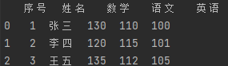
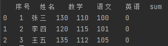
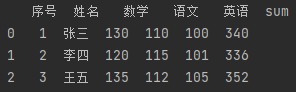

# Python文件操作与科学计算
## 一、文件操作
### 1.读文本文件
* 读整个文件，返回一个字符串
```python
f = open("read_test.txt", "r")
data = f.read()
print(data)
data = f.read()
print(data)
f.close()
```
**output**:\
'abslfajhlksjfldsjf\naskdhfkasdhfjkas\nsifuhisudfhsncsdf'\
''

* 读取一行，每次返回一个字符串
```python
f = open("read_test.txt", "r")
data1 = f.readline()
data2 = f.readline()
data3 = f.readline()
data4 = f.readline()
f.close()
print(data1)
print(data2)
print(data3)
print(data4)
```
**output**:\
'abslfajhlksjfldsjf\n'\
'askdhfkasdhfjkas\n'\
'sifuhisudfhsncsdf'\
''

* 读取多行，返回一个字符串列表
```python
f = open("read_test.txt", "r")
data = f.readlines()
f.close()
print(data)
```
**output**:\
['abslfajhlksjfldsjf\n', 'askdhfkasdhfjkas\n', 'sifuhisudfhsncsdf']

### 2.写文本文件
```python
f = open("write_test.txt", "w")
data = "kdhfkasdhfk"
f.write(data)
f.close()
```

### 3.写对象
```python
import pickle 
a = [123, 45, 789]
f = open("obj_test.pkl", "wb")
pickle.dump(a, f)
f.close()
```

### 4.读对象
```python
import pickle 
f = open("obj_test.pkl", "rb")
a = pickle.load(f)
f.close()
print(a)
```

## 二、excel文件操作
### 0.准备操作
* 安装pandas模块
```sh
pip install pandas
```
* 安装openpyxl模块
```sh
pip install openpyxl
```
### 1.读取excel文件
```python
import pandas as pd 
df = pd.read_excel('test.xlsx')
print(df)
print(df.shape)
```
**output**:\
\
(3,5)

### 2.添加一列
```python
df.insert(df.shape[1], 'sum', 0)
print(df)
print(df.shape)
```
**output**:\
\
(3,6)

### 3.按列求和
```python
for i in range(df.shape[0]):
    df.loc[i, 'sum'] = df.loc[i, '语文'] + df.loc[i, '数学'] + df.loc[i, '英语']
print(df)
```
**output**:\


### 4.输出excel
```python
df.to_excel('new.xlsx')
```

### 5.更多教程
https://mofanpy.com/tutorials/data-manipulation/pandas/

## 三、科学计算
### 0.准备工作
* 安装numpy
```shell
pip install numpy
```
### 1.创建矩阵
```python
import numpy as np

a = np.array([
    [1, 2, 3],
    [4, 5, 6],
    [7, 8, 9],
    [10, 11, 12]
])

b = np.array([
    [23, 8, 0],
    [14, 5, 7],
    [11, 9, 10]
])

print(a)
print(a.shape)
print(b)
print(b.shape)
```
**output**:\
[[ 1  2  3]\
 [ 4  5  6]\
 [ 7  8  9]\
 [10 11 12]]\
(4, 3)\
[[23  8  0]\
 [14  5  7]\
 [11  9 10]]\
(3, 3)

### 2.按元素做加减乘除
```python
print(a + a)
print(a - a)
print(a * a)
print(a / a)
```
**output**:\
[[ 2  4  6]\
 [ 8 10 12]\
 [14 16 18]\
 [20 22 24]]\
[[0 0 0]\
 [0 0 0]\
 [0 0 0]\
 [0 0 0]]\
[[  1   4   9]\
 [ 16  25  36]\
 [ 49  64  81]\
 [100 121 144]]\
[[1. 1. 1.]\
 [1. 1. 1.]\
 [1. 1. 1.]\
 [1. 1. 1.]]

### 3.按元素做幂运算
```python
c = np.power(a, 3)
print(c)
```
**output**:\
[[   1    8   27]\
 [  64  125  216]\
 [ 343  512  729]\
 [1000 1331 1728]]\

### 4.矩阵乘法
```python
print(a.shape)
print(b.shape)
c = a @ b
d = np.dot(a, b)
print(c)
print(d)
```
**output**:\
(4, 3)\
(3, 3)\
[[ 84  45  44]\
 [228 111  95]\
 [372 177 146]\
 [516 243 197]]\
[[ 84  45  44]\
 [228 111  95]\
 [372 177 146]\
 [516 243 197]]

### 5.矩阵求逆 
```python
c = np.linalg.inv(b)
print(c)
```
**output**:\
[[ 0.01618929  0.0996264  -0.06973848]\
 [ 0.07845579 -0.2864259   0.20049813]\
 [-0.08841843  0.14819427 -0.00373599]]

### 6.更多教程
https://mofanpy.com/tutorials/data-manipulation/numpy/